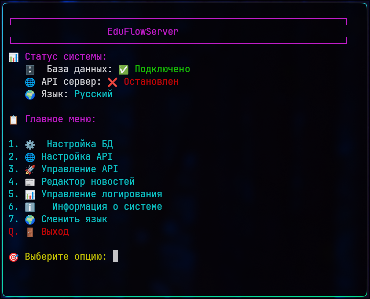
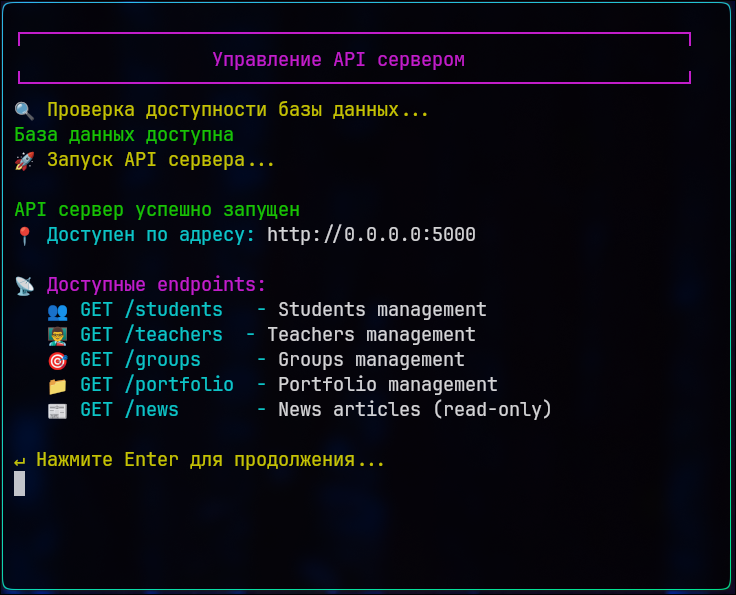
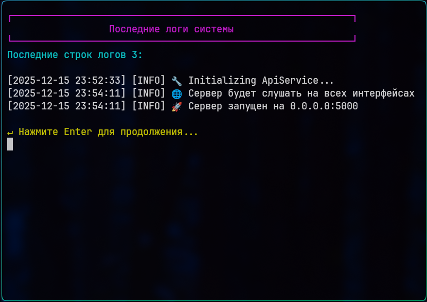

# Курсовая работа EduFlow, серверное ПО

🍩 **EduFlow Server** — это серверное программное обеспечение, предназначенное для обеспечения связи между клиентскими приложениями и базой данных в образовательной платформе EduFlow.

🀄 Курсовая работа для функционала сервера демонстрирующая работу с базой данных

### 🎁 Для чего нужен Edu Flow Server?

* EduFlow Server создан для связи между клиентом и сервером (учебной частью).

---

### 📋 Основные функции сервера:
🔗 Связь между клиентом и БД:

- Обработка API-запросов от клиентских приложений
- Валидация и преобразование данных
- Обеспечение безопасного доступа к базе данных

### 🎓 Образовательный функционал:
- Управление пользователями (студенты, преподаватели)
- Организация курсов и учебных материалов
- Ведение учёта портфолио студентов, мероприятий
- Удобная система распределений студентов по группам
- Возмоность управлять учётной записью и безопасностью

### 🔐 Ключевые возможности:
- RESTful API для клиентских приложений
- Аутентификация и авторизация
- Безопасное хранение образовательных данных
- Обработка транзакций
- Логирование запросов на сервер
- Отдельное логирование подозрительных запросов

### 🌟 Преимущества:
Централизованное управление данными
- Масштабируемость
- Кроссплатформенная совместимость
- Безопасность образовательной информации

✨ Сервер выступает ядром системы, обеспечивая надежную работу всей образовательной платформы *EduFlow*!

---

### 💿 Хочется компилировать самому?
Для вас уже готово решение по установке нужного ПО!

На Windows: С помощью VS Code (MinGW)

На Linux: ```./build_linux.sh```

> [!IMPORTANT]
>
> 📚 Проект используется как одной из важных частей курсового проекта "Студенты". Разработано студентом в направлении IT-сферы. Программа создана по структуре клиент-сервер с поддержкой работы API. Благодаря такой структуры легко размещать сервера и вести учёт данных с разных устройств, что позволяет легко масштабировать программу на учебные заведения.
>
> Для работы программы требуется postgres для функционала базы данных потребуется на Linux дистрибутивах использовать команды `install.sh` для установки компонентов программы.
>
> Исполняемый файл `check_system.sh` проверяет наличие компонентов и библиотек для функционирования серверной программы.
>
> `run_program.sh` инициирует запуск скомпилированного файла и находит его, если всё же невозможно найти исполняемый файл или проект пользователю на linux системе.
>
> **Важно** отметить что весь функционал программы спокойно работает на linux системах без перебоев и проблем.

---

### ⚡️ Демонстрационный пример работы серверной части:

<div align="center" style="margin: 50px 0;">
  
  <br>
  <em>Рисунок 1.1 - Пример работы серверной части: главное меню</em>
</div>

<div align="center" style="margin: 50px 0;">
  
  <br>
  <em>Рисунок 1.2 - Пример запуска API</em>
</div>

<div align="center" style="margin: 50px 0;">
  
  <br>
  <em>Рисунок 1.3 - Пример просмотра логов запросов</em>
</div>

---
### Что насчёт конфигов?
На проект выделено два json файла для сохранения параметров проекта:

`api_config.json`, обладающий параметрами:
- CORS Cross-Origin Resource Sharing параметры:
```json
"enableCors": true,
"corsOrigin": "*"
```
- host (переадресация для безопасности):
```json
"host": "0.0.0.0"
```
- maxConnections (максимальное количество подключений за единицу времени):
```json
"maxConnections": 10
```
- port (прослушиваемый порт API):
```json
"port": 5000
```
- sessionTimeoutHours (время жизни сессии, в часах):
```json
"sessionTimeoutHours": 72
```
- resetTokenTimeoutMinutes (время жизни токена сброса пароля):
```json
"resetTokenTimeoutMinutes": 60
```
- Rate Limiting (ограничение запросов):
```json
"rateLimitRequests": 100,
"rateLimitWindow": 60
```
100 запросов в течении 60 секунд, сделано в целях защиты от DDoS атак.

`database_config.json`, обладающий параметрами:

- database (Название базы данных):
```json
"database": "student_db"
```
- host (Определения наличия базы данных по IP, на локальной машине или в другомм месте):
```json
"host": "localhost"
```
- language (Определяет язык системы):
```json
"language": "en"
```
- password (Пароль пользователя в системе postgreSQL):
```json
"password": "qwerty123456"
```
- port (Прослушиваемый порт по которому идёт подключение к СУБД):
```json
"port": 5432
```
- username (Пользователь в системе СУБД PostgreSQL):
```json
"username": "student_app"
```

По результатам оценки параметров в конфигурационных файлов можно сказать, что `api_config.json` служит для функционирования и гибкой настройки API, для защиты от DDoS и прочего, а `database_config.json` служит для подключения к базе данных. Все эти конфигурации вы можете настроить в запущенной программе.

---

### Помощь автору

⭐️ Если вам будет не сложно, проявите помощь начинающему программисту, поставьте звёздочку на репозиторий. Такая помощь будет очень ценна.

📡 Скомпилированную серверную программу вы можете проверить и установить: [Yandex Disk](https://disk.yandex.ru/d/NFASjqljBU4P1w)

🛡 **Используется лицензия, ознакомьтесь с ней обязательном порядке!**